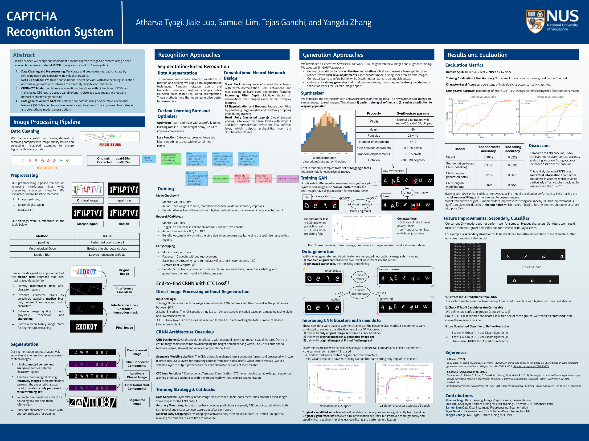

# CS4243 Mini Project: CAPTCHA Recognition System

<p align="center">
  
</p>

**Authors:** Atharva Tyagi, Jiale Luo, Samuel Lim, Tejas Gandhi, and Yangda Zhang  
**Course:** CS4243 — National University of Singapore

---

## Table of Contents

1. [Abstract](#abstract)  
2. [Image Processing Pipeline](#image-processing-pipeline)  
3. [Segmentation-Based Recognition](#segmentation-based-recognition)  
4. [End-to-End CRNN with CTC Loss](#end-to-end-crnn-with-ctc-loss)  
5. [Generation Approaches (GAN)](#generation-approaches-gan)  
6. [Results & Evaluation](#results--evaluation)  
7. [Discussion & Future Improvements](#discussion--future-improvements)  
8. [Getting Started](#getting-started)  
9. [License](#license)  
10. [References](#references)  

---

## Abstract

We design and implement a robust CAPTCHA recognition system using a deep convolutional neural network (CNN) backbone plus recurrent modules. Our approach rests on four pillars:

1. **Data Cleaning & Preprocessing**  
2. **Deep CNN Model**  
3. **CRNN + CTC Loss**  
4. **Data Generation with GAN**  

---

## Image Processing Pipeline

### 1. Data Cleaning  
- Manually remove mislabeled/low‑quality samples.  
- Correct label typos (e.g. `dua9865n` → `oua9865n`).

### 2. Preprocessing Methods  
| Method             | Issue                                   |
|--------------------|-----------------------------------------|
| Image Inpainting   | Performed poorly overall                |
| Morphological Open | Erodes thin character strokes           |
| Median Blur        | Leaves noticeable artifacts             |

**Our Mask‑Based Median Filter**  
1. Detect interference lines & character regions  
2. Apply median blur only on interference masks  
3. Enhance quality via grayscale sharpening  
4. Output a clean binary image for segmentation/training  

---

## Segmentation-Based Recognition

### Pipeline Overview
1. **Connected Components** → isolate each glyph  
2. **Adaptive Morphological Closing** → fix broken strokes  
3. **Bounding‑box Extraction** → crop each character  
4. **Resize & Normalize** → fit into CNN input shape  


### Data Augmentation  
- Rotations (±30°), zoom, translation (±5 px)  
- Gaussian noise for real‑world realism  

### CNN Architecture  
- **Stem Block**: Conv → BN → ReLU → MaxPool  
- **Depth Blocks**: Stacked Conv layers (32→256 filters)  
- **Head**: Dense (512→128) → Dropout → Softmax (36 classes)  

### Training Strategy & Callbacks  
- **Optimizer**: Adam (lr=1e‑3, weight_decay=1e‑6)  
- **Loss**: Categorical Cross‑Entropy + label smoothing  
- **ModelCheckpoint**  
  - Monitor: `val_accuracy`  
  - Save best on improvement  
- **ReduceLROnPlateau**  
  - Monitor: `val_loss`  
  - Factor: 0.5, patience: 2  
- **EarlyStopping**  
  - Monitor: `val_accuracy`  
  - Patience: 10 (baseline=0.40)  

---

## End-to-End CRNN with CTC Loss

Instead of explicit segmentation, we reshape CNN features into a sequence and attach Bidirectional LSTM layers:

1. **CNN Backbone** → extract spatial feature maps  
2. **Reshape** → time‑steps × feature vectors  
3. **Bidirectional LSTMs** → capture temporal context  
4. **CTC Loss** → align variable‑length predictions  


---

## Generation Approaches (GAN)

We adopt a SimGAN²‑style pipeline:

1. **Synthesizer (cookie‑cutter fonts)**  
2. **Refiner (conv + sigmoid)**  

**Training Losses**  
- **Discriminator**: BCE(real vs. fake)  
- **Generator**: BCE(fake vs. real) + self‑regularization  

**Data Generation**  
- **Modified Originals**: pixel‑level tweaks  
- **Fully Synthesized**: synthesizer + refiner outputs  

---

## Results & Evaluation

- **Split**: 70% train / 15% val / 15% test  
- **Metrics**: Character‑level & String‑level accuracy  

| Model                                | Test Char. Acc. | Test String Acc. |
|--------------------------------------|-----------------|------------------|
| Segmentation‑only CNN (baseline)     | 0.9166          | 0.6556           |
| CRNN + CTC (orig. data)              | 0.9602          | 0.8229           |
| + GAN‑modified data                  | 0.9199          | 0.6676           |
| + GAN‑synthesized data               | **0.9250**      | **0.6828**       |

---

## Discussion & Future Improvements

- **CRNN’s Contextual Strength** yields +17% string gain vs. segmentation CNN.  
- **GAN‑Enhanced Data** improves robustness, adds ≈3% string accuracy.  
- **Secondary Classifier** for ambiguous glyphs (e.g. “0” vs. “O”).  
- **Attention Modules** or **Domain Adaptation** for new CAPTCHA styles.

---

## Getting Started

### Prerequisites

- Python 3.8+  
- `virtualenv` or `conda`  
- (Optional) GPU with CUDA  

### Installation

```bash
git clone https://github.com/yourusername/cs4243-captcha-recognition.git
cd cs4243-captcha-recognition
pip install -r requirements.txt
```
### Data Preparation

```bash
# 1. Clean & preprocess
python src/preprocessing/run_cleaning.py \
  --input data/raw --output data/cleaned

# 2. (Optional) Generate synthetic data
python src/gan/train_gan.py \
  --real data/cleaned --out data/gan_synth
```

### Training

```bash
# Segmentation CNN
python src/train_segmentation.py \
  --data data/cleaned --batch 64 --epochs 50 \
  --out models/segmentation

# End-to-End CRNN
python src/train_crnn.py \
  --data data/cleaned --batch 32 --epochs 100 \
  --out models/crnn
```

### Evaluation

```bash
python src/evaluate.py \
  --model models/crnn/best.h5 \
  --test data/test \
  --metrics
```

---

## License

This project is licensed under the MIT License. See [LICENSE](LICENSE) for details.

---

## References

1. Shi et al., “An End-to-End Trainable Neural Network for Image-based Sequence Recognition…” (2016)
2. Shrivastava et al., “Learning from Simulated and Unsupervised Images…” (2017)
3. SimGAN²: Wang et al., “SimGAN:…” (2018)
4. CS4243 course slides & materials, 2025

